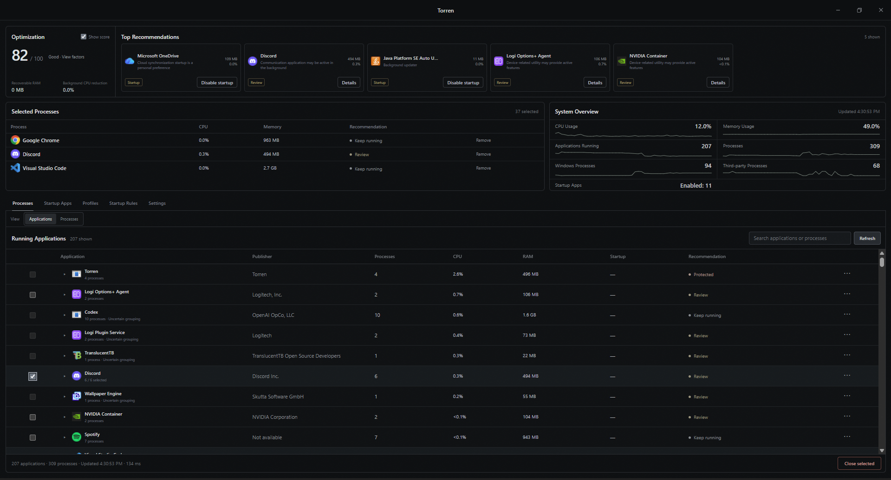

# Torren

**Understand running processes, manage startup behavior, and reduce unnecessary background activity on Windows.**

[**Download for Windows**](https://selitzer.github.io/torren/) / [Features](#features) / [Safety](#safety)

## Download

Torren is available for **Windows 10 and Windows 11**.

1. Visit the [**official Torren website**](https://selitzer.github.io/torren/).
2. Select **Download for Windows**.
3. Open the installer and complete setup.
4. Launch Torren from the Start Menu.

> **Note:** The current installer is unsigned. Windows SmartScreen may ask you to confirm that you want to run it.

## About

Torren is a desktop system utility that makes running applications and background processes easier to understand. It combines live system monitoring, application grouping, startup management, and reusable optimization tools in one compact interface.

Torren keeps the user in control. Applications are never selected or closed automatically unless the user has explicitly configured an action or startup rule.

## Features

**Live System Monitoring**

- Live CPU and memory usage
- Running application and process counts
- Compact system-history graphs
- Automatic refresh with stable selection and search state

**Applications and Processes**

- Group related processes into recognizable applications
- Switch between grouped Applications and raw Processes views
- Search and sort by application, process, publisher, PID, or status
- Inspect detailed metadata, current usage, and process relationships

**Process Analysis**

- Deterministic process classification
- Conservative recommendations with supporting evidence
- Clear confidence, caution, and protection states
- Optimization Score with ranked opportunities

**Startup Management**

- View applications configured to launch with Windows
- Enable or disable supported startup entries
- Search, filter, and inspect startup applications
- Create Close on Startup rules for explicitly selected applications

**Optimization Profiles**

- Create reusable optimization plans
- Close selected applications and manage startup behavior
- Preview actions and current resource estimates before running
- Review completed, skipped, protected, and failed results

**Application Control**

- Select individual processes or complete application groups
- Request a normal application close before force closing
- Revalidate application identity before every close attempt
- Detect protected, exited, changed, or automatically restarted processes

## Safety

Torren uses conservative safeguards before allowing a process or application to be closed.

- Critical Windows processes remain protected
- Protected system and security components cannot be selected
- Torren cannot close its own process tree
- Process identity is verified immediately before termination
- Destructive manual actions require confirmation
- Applications with uncertain grouping cannot be closed as a group

Closing an eligible application may still interrupt active work or discard unsaved changes. Torren presents warnings and current information so the user can make the final decision.

## Tech Stack

| Layer | Tech |
|---|---|
| Desktop Shell | Electron / Electron Builder |
| Frontend | React / TypeScript / Vite |
| Styling | CSS |
| Installer | NSIS |
| Platform | Windows 10 / 11 |

## System Requirements

| Requirement | Supported |
|---|---|
| Operating System | Windows 10 or Windows 11 |
| Architecture | x64 |
| Installation | Per-user Windows installer |
| Internet Connection | Not required for process monitoring |

## Privacy

Torren performs process analysis locally. It does not require an account and does not send process information to an external analysis service.
